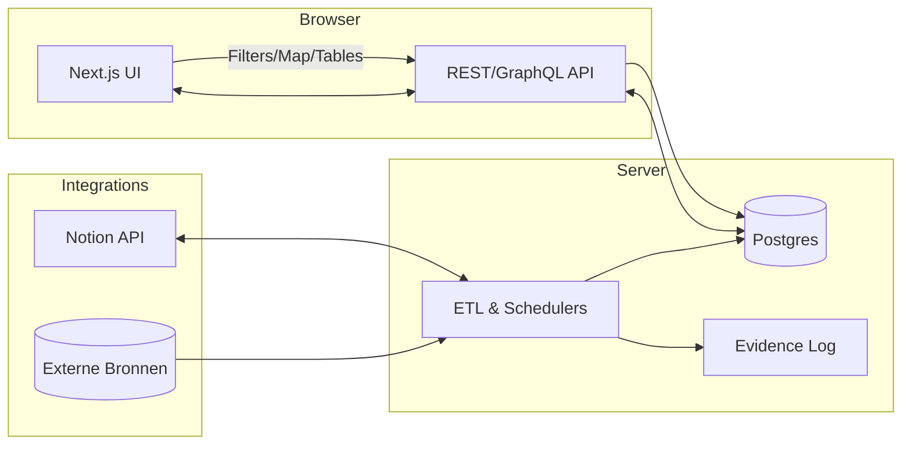

# Live Dashboard Plan

## 1. Doel & Scope
Het doel is een **real-time (of near-real-time) dashboard** dat Europese steden en regio’s vergelijkt op: **kosten van wonen/leven**, **internetkwaliteit**, **IT-ecosysteem**, **OV-bereikbaarheid**, en **legaliteit/compliance** voor een Nederlandse WIA-situatie. Het dashboard ondersteunt twee gebruiksmodi:

- **Micro-roamen (14–28 dagen)** met OV-first en coworking-proefpassen.
- **EU-basecamp** (langere verblijven) met WIA-export, RNI-overweging en briefadres-logica in NL.

## 1.2 Randvoorwaarden

- **Legaal-eerst**: geen schijninschrijving/fake adressen.
- **OV-first**: rail/coach/luchthubs als primaire modaliteit.
- **Netwerkminima**: ≥50/10 Mbps, latency ~50 ms.
- **Transparantie**: elke datapunt heeft `last_verified`, `evidence_label` (High/Medium/Low) en bron-URL.
- **Privacy & integriteit**: geen PII zonder noodzaak, geen scraping waar ToS dat verbiedt.

---

## 2. Kern-features

### 2.1 City Explorer

- Kaart + tabel met steden; filters voor **kostenband**, **MobilityScore**, **NetScore**, **coworking**, **taal**, **veiligheid**, **inschrijfbaarheid**.
- Detailpaneel per stad met: prijsindicaties, internet, coworking-prijzen, OV-toegang (rail/coach/airport ≤60 min), tech-scene-notities en **compliance-notities**.

### 2.2 Compliance Console

- Landkaart met **WIA-export** haalbaarheid, **inschrijving/registratie** opties, **zorg/EHIC** en officiële links.
- **Checklistgenerator** per trip: “UWV melden?”, “EHIC ok?”, “Post geregeld?”.

### 2.3 Trips-planner

- Tijdlijn met **Start/End**, automatische `TripLengthDays`, **UWV-meldtaak** (14 dagen vóór vertrek), **rolling teller buitenland-dagen (365)** + waarschuwing bij **≥240** dagen.

### 2.4 Evidence-log

- Per datapunt: `source_url`, `source_published_at`, `last_verified`, `evidence_label`, `notes`, `conflict_resolution` veld.

---

## 3. Data & Bronnen (Architectuur)

### 3.1 Externe bronnen (indicatief)

- **Kosten/huur**: Eurostat; huurindices van aanbieders (API/CSV waar toegestaan).
- **Internet**: vaste/mobiele medianen per land/regio (officiële ISP/telecom-rapporten, regulator-statistieken).
- **OV & mobiliteit**: GTFS-feeds, spoorwegmaatschappijen, coach-operators, luchthaven-connectiviteit.
- **Coworking**: platform-APIs/CSV’s en directe providers (prijzen, 24/7, afstand station).
- **Ecovillages/alternatieven**: federaties/directories met legale status en contactpunten.

### 3.2 Datamodel (relationeel, vereenvoudigd)

- `countries(id, name, eu_efta_flag, wia_export_notes, legal_links[])`
- `cities(id, country_id, name, col_band_low, col_band_median, col_band_high, safety_index, language_notes, tech_scene_notes)`
- `connectivity(city_id, fixed_median_down, fixed_median_up, fixed_latency_ms, mobile_median_down, mobile_median_up, last_verified, evidence_label, source_url)`
- `mobility(city_id, rail_hub:boolean, coach_hub:boolean, airport_within_60min:boolean, hsr:boolean, notes, last_verified, evidence_label, source_url)`
- `coworking(city_id, daypass_eur, monthly_eur, twentyfour_seven:boolean, distance_station_min, last_verified, evidence_label, source_url)`
- `housing_options(city_id, type, allowed_status{toegestaan|beperkt|verboden}, can_register_address:boolean, price_low, price_high, red_flags[], notes, last_verified, evidence_label, source_url)`
- `compliance(city_id, registration_notes, pitfalls, dn_markup_notes, taxes_tourist_notes, last_verified, evidence_label, source_url)`
- `scores(city_id, mobility_score, net_score, updated_at)`
- `trips(id, city_id, start_date, end_date, trip_length_days, uwv_task_due, ehic_check:boolean, post_ready:boolean)`
- `evidence_log(entity_type, entity_id, field, source_url, source_published_at, last_verified, evidence_label, conflict_with[], resolution_note)`

### 3.3 Evidence-labels

- **High**: wet/regelgeving/overheid/statistiekbureau.
- **Medium**: sector/OV/ISP/coworking-providers.
- **Low**: blogs/fora; uitsluitend voor hypotheses.

---

## 4. Score-definities (Transparant & Herleidbaar)

### 4.1 MobilityScore (0–5)
Berekening op basis van:

- Rail-hub (1), coach-hub (1), airport ≤60 min (1), HSR (1), frequentie/verbinding-dichtheid (0–1).
  **Formule:** `min(5, rail_hub + coach_hub + airport + hsr + freq_score)`

### 4.2 NetScore (0–5)

- Start bij 2 indien vaste verbinding `≥50/10 Mbps` en latency `≤50 ms`.
- +1 als median fixed ≥150/50; +1 als median mobile ≥100/20; +1 voor bewezen stabiliteit/FUP gunstig.
- Cap op 5, degrade −1 als alleen mobiel voldoet.
  **Formule (indicatief):** `base(2/0) + fixed_bonus + mobile_bonus + stability_bonus − mobile_only_penalty`

---

## 5. Systeemarchitectuur

### 5.1 Overzicht

- **Frontend**: Next.js (React), Map (Leaflet), tabel (TanStack), grafieken (ECharts), i18n (EN/NL).
- **Backend API**: Node (Fastify/Nest) of Python (FastAPI).
- **DB**: Postgres (Supabase) of SQLite voor single-node.
- **ETL/Jobs**: server-side cron (BullMQ/Temporal) of GitHub Actions schedulers.
- **Auth**: OAuth (Google) + rol-gebaseerd (viewer/editor/admin).
- **Integratie**: Notion API (sync naar/van “Countries”, “Cities”, “Trips”).
- **Telemetry**: OpenTelemetry → Grafana/Tempo/Loki; app-health endpoints.

### 5.2 Mermaid (hoog niveau)



---

## 6. ETL-pijplijn & Validatie

### 6.1 Stappen

- **Extract**: API/CSV/official datasets; respecteer ToS, rate-limits, robots.
- **Transform**: normaliseer eenheden naar **EUR**; noteer wisselkoers + datum in `evidence_log`.
- **Load**: upsert per entiteit; wijzigingsdetectie met `hash(row)`; zet `last_verified`.
- **Validate**: schema-checks (Pydantic/Zod), outlier-detectie, bron-conflicten markeren.
- **Annotate**: vul `evidence_label`, `source_published_at`, `conflict_resolution`.
- **Recalculate**: herbereken `MobilityScore`/`NetScore` en city-aggregates.

### 6.2 Frequenties

- **Prijzen/huur**: maandelijks/kwartaal.
- **Internet**: maandelijks.
- **OV**: per feed-update; luchthub-afstand statisch + periodieke sanity-check.
- **Coworking**: maandelijks.
- **Compliance**: handmatig + release-notities bij wijzigingen.

### 6.3 Foutenafhandeling

- Retries met jitter; circuit breaker bij bron-fouten.
- “Stale-badge” in UI als `last_verified` > N dagen.
- Conflict-banner met “waarom voorkeur” tekst.

---

## 7. UI-ontwerp (Functioneel)

### 7.1 Hoofdscherm

- **Bovenbalk**: datum van laatste dataset-sync; globale filters; export (CSV/JSON/Notion-sync).
- **Linkerpaneel**: kaart + heat-layer voor kosten of internet.
- **Rechterpaneel**: sorteerbare tabel; kolommen: Stad, Land, Kosten (laag/median/hoog), MobilityScore, NetScore, Coworking-maandprijs, Luchthaven ≤60m, Laatst geverifieerd, Evidence.

### 7.2 Detailstad

- Tabs: *Kosten*, *Internet*, *OV*, *Coworking*, *Compliance*, *Housing Options*, *Evidence Log*.
- Callouts: **Trade-offs** (bijv. laag kosten ↔ zwakke registratie), **Red Flags** (toeristenbelasting, seizoenspiek).

### 7.3 Trips

- Kalender met badges: “UWV melden?”, “EHIC ok?”, “Post geregeld?”.
- Automatische teller buitenland-dagen (365) + waarschuwing ≥240.

---

## 8. Integratie met Notion

### 8.1 Databases

- `Countries`, `Cities`, `Trips`, `Legal Console`, `Housing Options`, `Evidence Log`.
- Bidirectionele sync (API): dashboard is **bron van waarheid**; Notion als werkboek en rapportage.

### 8.2 Velden (voorbeeld `Cities`)

- `Name`, `Country`, `CostBandLow/Median/High (EUR)`, `MobilityScore`, `NetScore`, `CoworkingMonthly`, `Airport≤60m`, `ComplianceNotes`, `LastVerified`, `EvidenceLabel`, `SourceURL[]`.

---

## 9. Beveiliging & Compliance

### 9.1 App-security

- TLS overal; headers (CSP/STS), rate-limiting, input-sanitatie.
- Secrets in `.env` + KMS/Parameter Store.
- RBAC: viewer/editor/admin; audit-log bij wijzigingen.

### 9.2 Juridisch

- Respecteer databron-licenties; caching met `etag/last-modified`; geen scraping buiten ToS.
- NL-context: **geen fake adres**; gebruik **briefadres volgens regels**; bij >8 maanden buitenlanddagen: **RNI en WIA-export** evalueren.

---

## 10. Deployment

### 10.1 Targets

- **MVP**: Docker Compose (frontend, api, db, jobs).
- **Prod**: Kubernetes (ingress, HPA, secrets, Postgres managed).
- **CDN/Edge**: cache van city-lijsten/tiles met korte TTL.

### 10.2 Omgevingsvariabelen (voorbeeld)

```
APP_ENV=production
DATABASE_URL=postgres://...
NOTION_API_KEY=...
OPENMAP_TOKEN=...
CURRENCY_BASE=EUR
SYNC_SCHEDULE_CRON="0 2 * * *"
```

---

## 11. Teststrategie

### 11.1 Unit & Contract

- Schema-validatie (Zod/Pydantic).
- API-contracttests (OpenAPI + Dredd).

### 11.2 Data-kwaliteitschecks

- Range-checks (negatieve prijzen afvangen).
- Outliers (IQR/σ).
- “Staleness” alarms bij verouderde `last_verified`.

### 11.3 E2E

- Cypress/Playwright: City Explorer filters, Trips-planner logica, evidence-badges.

---

## 12. Roadmap

### 12.1 MVP (2–3 iteraties)

- ETL voor 4 startsteden; basiskaart + tabel; Net/MobilityScore; Trips-planner met UWV-badge; Evidence-log; Notion-sync v1.

### 12.2 v1.1

- Coworking-prijzen, airport-afstand-berekening, GTFS integratie, i18n, export CSV/JSON.

### 12.3 v1.2

- Housing Options-catalogus per stad; legal console met officiële links; conflict-resolver UI.

### 12.4 v1.3

- Alerts (datastale, ≥240 buitenland-dagen), eenvoudige scenario-simulator (basecamp vs micro-roamen).

---

## 13. Definition of Done (MVP)

- 4 steden volledig gevuld met **High/Medium** evidence waar mogelijk.
- Scores reproduceerbaar uit databasetabellen.
- ETL herhaalbaar (idempotent); logs + retries werkend.
- UI levert filters, detailtabs, evidence-weergave.
- Notion-sync 2-richtingen succesvol.
- Documentatie: **README**, **.env.example**, **OpenAPI.json**, **ETL-runbook**, **datadictionary.md**.

---

## 14. Bijlagen

### 14.1 Datadictionary (uittreksel)

- `col_band_low/median/high`: maandelijkse huur (EUR), bron + koersdatum indien conversie.
- `fixed_median_*`: mediane vaste breedband (Mbit/s), `last_verified` + bron.
- `mobile_median_*`: mediane mobiel (Mbit/s), idem.
- `airport_within_60min`: boolean + methode (PT/auto-onafhankelijk).
- `allowed_status`: juridisch kader per woonvorm (toegestaan/beperkt/verboden) met beleid/zoneringlink.

### 14.2 Makefile (schets)

```
setup: ## init env & deps
@cp -n .env.example .env || true
@npm i --prefix ./frontend && npm i --prefix ./api

run: ## dev up
@docker compose up -d

sync: ## run ETL now
@docker compose exec api npm run etl:sync

test:
@npm test --prefix ./api && npm test --prefix ./frontend

deploy:
@./infra/deploy.sh
```

---

## 15. Volgende Concrete Stap

- Initieer een lege repo met: `/frontend`, `/api`, `/etl`, `/db/migrations`, `/docs` en voeg **.env.example**, **OpenAPI-skelet**, **datadictionary.md** en **Makefile** toe.
- Vul 4 startsteden (Wrocław, Cluj-Napoca, Sofia, Valencia) handmatig met bron-URLs en `evidence_label`.
- Draai **eerste ETL-job** met mock/CSV om de volledige pijplijn, evidence-logging en score-berekening end-to-end te verifiëren.
