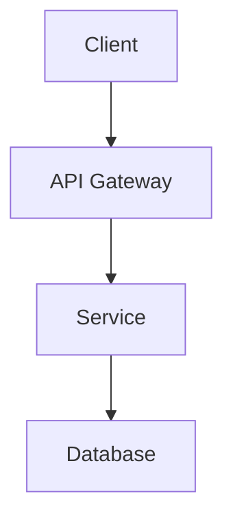

# Advanced Development System Recommendations

## Executive Summary

This document provides comprehensive recommendations for building a highly advanced, skilled development system optimized for Windows 11 Pro with WSL2, Docker, and AI-augmented workflows. The architecture emphasizes automation, reproducibility, security, and developer velocity.

---

## 1. Infrastructure Architecture

### 1.1 Layered Development Stack

```
┌─────────────────────────────────────────────────────────────────┐
│                    AI ORCHESTRATION LAYER                        │
│  Claude Desktop │ Cursor │ Windsurf │ GitHub Copilot │ Gordon   │
├─────────────────────────────────────────────────────────────────┤
│                      MCP GATEWAY LAYER                           │
│  Docker MCP │ GitHub │ Filesystem │ Memory │ Redis │ Git        │
├─────────────────────────────────────────────────────────────────┤
│                   CONTAINER ORCHESTRATION                        │
│  Docker Desktop │ Docker Compose │ Dev Containers │ Kubernetes  │
├─────────────────────────────────────────────────────────────────┤
│                      WSL2 LINUX LAYER                            │
│  Ubuntu 22.04 │ Development Tools │ Language Runtimes           │
├─────────────────────────────────────────────────────────────────┤
│                    WINDOWS 11 PRO HOST                           │
│  Hyper-V │ Windows Terminal │ PowerShell 7 │ VS Code            │
└─────────────────────────────────────────────────────────────────┘
```

### 1.2 Recommended Hardware Specifications

| Component | Minimum | Recommended | Optimal |
|-----------|---------|-------------|---------|
| CPU | 8 cores | 16 cores | 32+ cores |
| RAM | 32GB | 64GB | 128GB |
| Storage | 512GB NVMe | 1TB NVMe | 2TB+ NVMe (Dev Drive) |
| GPU | - | RTX 3080 | RTX 4090 / A100 |

### 1.3 Windows Dev Drive Configuration

```powershell
# Create a Dev Drive for optimized developer workloads
# Dev Drive uses ReFS with performance optimizations

# Check if Dev Drive is available
Get-Volume | Where-Object { $_.FileSystemType -eq 'ReFS' }

# Configure package manager caches to use Dev Drive
# Set environment variables in system settings:
# - npm_config_cache=D:\DevDrive\.npm
# - PIP_CACHE_DIR=D:\DevDrive\.pip
# - CARGO_HOME=D:\DevDrive\.cargo
# - GOPATH=D:\DevDrive\go
```

---

## 2. Development Environment Configuration

### 2.1 WSL2 Optimization

```bash
# /etc/wsl.conf - Place in your WSL distro
[boot]
systemd=true

[automount]
enabled=true
options="metadata,umask=22,fmask=11"
mountFsTab=true

[network]
generateHosts=true
generateResolvConf=true

[interop]
enabled=true
appendWindowsPath=true
```

```ini
# %USERPROFILE%\.wslconfig - Windows host configuration
[wsl2]
memory=48GB
processors=12
swap=8GB
localhostForwarding=true
nestedVirtualization=true
kernelCommandLine=cgroup_no_v1=all

[experimental]
sparseVhd=true
autoMemoryReclaim=gradual
```

### 2.2 Docker Desktop Optimization

```json
// Docker Desktop settings.json optimizations
{
  "cpus": 12,
  "memoryMiB": 32768,
  "swapMiB": 4096,
  "diskSizeMiB": 262144,
  "filesharingDirectories": [
    "C:\\Users\\Admin\\Documents",
    "D:\\DevDrive"
  ],
  "wslEngineEnabled": true,
  "useVirtualizationFrameworkRosetta": false,
  "useResourceSaver": true,
  "enableIntegrityCheck": true
}
```

### 2.3 Terminal Configuration

**Windows Terminal settings.json enhancements:**

```json
{
  "profiles": {
    "defaults": {
      "font": {
        "face": "JetBrains Mono NF",
        "size": 11,
        "weight": "normal"
      },
      "useAcrylic": true,
      "acrylicOpacity": 0.85,
      "cursorShape": "filledBox",
      "bellStyle": "none"
    }
  },
  "actions": [
    { "command": "toggleFocusMode", "keys": "alt+z" },
    { "command": { "action": "splitPane", "split": "right" }, "keys": "alt+shift+=" },
    { "command": { "action": "splitPane", "split": "down" }, "keys": "alt+shift+-" }
  ]
}
```

---

## 3. AI-Augmented Development Workflow

### 3.1 MCP Server Architecture

**Recommended MCP Server Stack:**

| Server | Purpose | Priority |
|--------|---------|----------|
| `docker` | Container management | Essential |
| `filesystem` | File operations | Essential |
| `git` | Version control | Essential |
| `github` | Repository management | Essential |
| `memory` | Persistent knowledge graph | High |
| `sequentialthinking` | Complex reasoning | High |
| `redis` | Caching & data ops | High |
| `fetch` | HTTP operations | Medium |
| `playwright` | Browser automation | Medium |
| `brave-search` | Web search | Medium |

### 3.2 AI Agent Configuration

```yaml
# Recommended AI agent configuration pattern
agents:
  primary:
    model: claude-3.5-sonnet
    context_window: 200k
    tools:
      - mcp_docker
      - mcp_github
      - mcp_filesystem
      - mcp_memory
    
  code_review:
    model: claude-3.5-sonnet
    specialized: true
    focus: security, performance, best_practices
    
  documentation:
    model: claude-3.5-haiku
    specialized: true
    focus: technical_writing, api_docs
```

### 3.3 Prompt Engineering Patterns

```markdown
## System Prompt Template for Development Tasks

You are an expert software engineer with deep knowledge of:
- System architecture and design patterns
- Security best practices and threat modeling
- Performance optimization and profiling
- CI/CD pipelines and DevOps practices

When approaching tasks:
1. Analyze requirements thoroughly before implementation
2. Consider edge cases and error handling
3. Write tests alongside implementation
4. Document decisions and trade-offs
5. Optimize for maintainability over cleverness

Available tools: {mcp_tools}
Project context: {project_context}
```

---

## 4. Project Structure Standards

### 4.1 Monorepo Architecture

```
project-root/
├── .devcontainer/           # Dev container configuration
│   ├── devcontainer.json
│   └── Dockerfile
├── .github/
│   ├── workflows/           # CI/CD pipelines
│   │   ├── ci.yml
│   │   ├── release.yml
│   │   └── security.yml
│   ├── CODEOWNERS
│   └── dependabot.yml
├── .vscode/
│   ├── settings.json
│   ├── launch.json
│   ├── tasks.json
│   └── extensions.json
├── apps/                    # Application packages
│   ├── web/
│   ├── api/
│   └── cli/
├── packages/                # Shared libraries
│   ├── core/
│   ├── ui/
│   └── utils/
├── infrastructure/          # IaC definitions
│   ├── terraform/
│   ├── kubernetes/
│   └── docker/
├── scripts/                 # Automation scripts
│   ├── setup.ps1
│   ├── dev.sh
│   └── deploy.sh
├── docs/                    # Documentation
│   ├── architecture/
│   ├── api/
│   └── runbooks/
├── tests/                   # Integration/E2E tests
├── docker-compose.yml
├── Makefile
└── README.md
```

### 4.2 Configuration Management

```yaml
# config/default.yaml - Hierarchical configuration
app:
  name: ${APP_NAME:myapp}
  environment: ${NODE_ENV:development}
  
server:
  host: ${HOST:0.0.0.0}
  port: ${PORT:8080}
  
database:
  host: ${DB_HOST:localhost}
  port: ${DB_PORT:5432}
  name: ${DB_NAME:app_db}
  pool:
    min: 2
    max: 10
    
cache:
  host: ${REDIS_HOST:localhost}
  port: ${REDIS_PORT:6379}
  ttl: 3600
  
logging:
  level: ${LOG_LEVEL:info}
  format: json
  
features:
  experimental: ${ENABLE_EXPERIMENTAL:false}
```

---

## 5. CI/CD Pipeline Architecture

### 5.1 GitHub Actions Workflow Template

```yaml
name: Advanced CI/CD Pipeline

on:
  push:
    branches: [main, develop]
  pull_request:
    branches: [main]

concurrency:
  group: ${{ github.workflow }}-${{ github.ref }}
  cancel-in-progress: true

env:
  REGISTRY: ghcr.io
  IMAGE_NAME: ${{ github.repository }}

jobs:
  # Stage 1: Code Quality
  quality:
    runs-on: ubuntu-latest
    steps:
      - uses: actions/checkout@v4
      - name: Lint & Format Check
        run: |
          npm ci
          npm run lint
          npm run format:check
      - name: Type Check
        run: npm run typecheck
      - name: Security Audit
        run: npm audit --audit-level=high

  # Stage 2: Testing Matrix
  test:
    needs: quality
    runs-on: ubuntu-latest
    strategy:
      matrix:
        node: [18, 20, 22]
        shard: [1, 2, 3, 4]
    steps:
      - uses: actions/checkout@v4
      - uses: actions/setup-node@v4
        with:
          node-version: ${{ matrix.node }}
          cache: 'npm'
      - run: npm ci
      - name: Run Tests (Shard ${{ matrix.shard }}/4)
        run: npm test -- --shard=${{ matrix.shard }}/4

  # Stage 3: Build & Push
  build:
    needs: test
    runs-on: ubuntu-latest
    permissions:
      contents: read
      packages: write
    outputs:
      image-digest: ${{ steps.build.outputs.digest }}
    steps:
      - uses: actions/checkout@v4
      - uses: docker/setup-buildx-action@v3
      - uses: docker/login-action@v3
        with:
          registry: ${{ env.REGISTRY }}
          username: ${{ github.actor }}
          password: ${{ secrets.GITHUB_TOKEN }}
      - id: build
        uses: docker/build-push-action@v5
        with:
          push: true
          tags: ${{ env.REGISTRY }}/${{ env.IMAGE_NAME }}:${{ github.sha }}
          cache-from: type=gha
          cache-to: type=gha,mode=max
          provenance: true
          sbom: true

  # Stage 4: Security Scanning
  security:
    needs: build
    runs-on: ubuntu-latest
    steps:
      - uses: aquasecurity/trivy-action@master
        with:
          image-ref: ${{ env.REGISTRY }}/${{ env.IMAGE_NAME }}:${{ github.sha }}
          format: 'sarif'
          output: 'trivy-results.sarif'
      - uses: github/codeql-action/upload-sarif@v3
        with:
          sarif_file: 'trivy-results.sarif'

  # Stage 5: Deploy
  deploy:
    needs: [build, security]
    if: github.ref == 'refs/heads/main'
    runs-on: ubuntu-latest
    environment: production
    steps:
      - name: Deploy to Production
        run: |
          echo "Deploying ${{ needs.build.outputs.image-digest }}"
```

### 5.2 Pre-commit Hooks

```yaml
# .pre-commit-config.yaml
repos:
  - repo: https://github.com/pre-commit/pre-commit-hooks
    rev: v4.5.0
    hooks:
      - id: trailing-whitespace
      - id: end-of-file-fixer
      - id: check-yaml
      - id: check-json
      - id: check-added-large-files
        args: ['--maxkb=1000']
      - id: detect-private-key
      - id: check-merge-conflict

  - repo: https://github.com/gitleaks/gitleaks
    rev: v8.18.0
    hooks:
      - id: gitleaks

  - repo: local
    hooks:
      - id: lint
        name: Lint
        entry: npm run lint
        language: system
        pass_filenames: false
      - id: typecheck
        name: Type Check
        entry: npm run typecheck
        language: system
        pass_filenames: false
```

---

## 6. Security Best Practices

### 6.1 Secrets Management

```powershell
# Use Docker secrets or environment-specific vaults
# Never commit secrets to version control

# Option 1: Docker Secrets (Swarm mode)
docker secret create api_key ./api_key.txt

# Option 2: Environment files with .gitignore
# .env.local (gitignored)
API_KEY=your-secret-key

# Option 3: External secret managers
# - HashiCorp Vault
# - AWS Secrets Manager
# - Azure Key Vault
# - 1Password CLI
```

### 6.2 Container Security

```dockerfile
# Security-hardened Dockerfile pattern
FROM node:20-alpine AS builder

# Don't run as root
RUN addgroup -g 1001 -S appgroup && \
    adduser -u 1001 -S appuser -G appgroup

WORKDIR /app
COPY --chown=appuser:appgroup package*.json ./
RUN npm ci --only=production

FROM gcr.io/distroless/nodejs20-debian12
COPY --from=builder /app /app
WORKDIR /app
USER 1001
EXPOSE 8080
CMD ["server.js"]
```

### 6.3 Network Security

```yaml
# docker-compose.yml network isolation
services:
  app:
    networks:
      - frontend
      - backend
    
  db:
    networks:
      - backend  # Not exposed to frontend
    
  redis:
    networks:
      - backend

networks:
  frontend:
    driver: bridge
  backend:
    driver: bridge
    internal: true  # No external access
```

---

## 7. Observability Stack

### 7.1 Logging Architecture

```yaml
# Structured logging configuration
logging:
  driver: json-file
  options:
    max-size: "10m"
    max-file: "3"
    labels: "service,environment"
    
# Application logging format
{
  "timestamp": "2026-02-04T15:38:00.000Z",
  "level": "info",
  "service": "api",
  "trace_id": "abc123",
  "span_id": "def456",
  "message": "Request processed",
  "duration_ms": 45,
  "status_code": 200
}
```

### 7.2 Metrics & Monitoring

```yaml
# docker-compose.monitoring.yml
services:
  prometheus:
    image: prom/prometheus:latest
    volumes:
      - ./prometheus.yml:/etc/prometheus/prometheus.yml
      - prometheus_data:/prometheus
    command:
      - '--config.file=/etc/prometheus/prometheus.yml'
      - '--storage.tsdb.retention.time=15d'
    ports:
      - "9090:9090"

  grafana:
    image: grafana/grafana-oss:latest
    volumes:
      - grafana_data:/var/lib/grafana
      - ./grafana/dashboards:/etc/grafana/provisioning/dashboards
    environment:
      - GF_SECURITY_ADMIN_PASSWORD=${GRAFANA_PASSWORD}
      - GF_INSTALL_PLUGINS=grafana-clock-panel
    ports:
      - "3000:3000"

  node-exporter:
    image: prom/node-exporter:latest
    volumes:
      - /proc:/host/proc:ro
      - /sys:/host/sys:ro
    command:
      - '--path.procfs=/host/proc'
      - '--path.sysfs=/host/sys'
```

---

## 8. Development Workflow Automation

### 8.1 Task Runner Configuration

```makefile
# Makefile - Universal task runner
.PHONY: help dev build test deploy clean

help: ## Show this help
	@grep -E '^[a-zA-Z_-]+:.*?## .*$$' $(MAKEFILE_LIST) | sort | awk 'BEGIN {FS = ":.*?## "}; {printf "\033[36m%-20s\033[0m %s\n", $$1, $$2}'

dev: ## Start development environment
	docker-compose up -d
	npm run dev

build: ## Build production artifacts
	docker-compose -f docker-compose.prod.yml build

test: ## Run all tests
	npm run test:unit
	npm run test:integration
	npm run test:e2e

lint: ## Run linters
	npm run lint
	npm run format:check

security: ## Run security scans
	npm audit
	docker scout cves

deploy-staging: ## Deploy to staging
	./scripts/deploy.sh staging

deploy-prod: ## Deploy to production (requires approval)
	./scripts/deploy.sh production

clean: ## Clean all artifacts
	docker-compose down -v
	rm -rf node_modules dist coverage
```

### 8.2 Git Workflow

```bash
# .gitconfig recommendations
[alias]
    co = checkout
    br = branch
    ci = commit
    st = status
    lg = log --oneline --graph --decorate --all
    unstage = reset HEAD --
    last = log -1 HEAD
    visual = !gitk
    
    # Advanced aliases
    fixup = commit --fixup
    squash = commit --squash
    ri = rebase -i
    
    # Branch cleanup
    cleanup = "!git branch --merged | grep -v '\\*\\|main\\|develop' | xargs -n 1 git branch -d"

[pull]
    rebase = true

[push]
    autoSetupRemote = true

[rebase]
    autoStash = true

[merge]
    conflictStyle = diff3

[diff]
    algorithm = histogram
```

---

## 9. Performance Optimization

### 9.1 Build Optimization

```dockerfile
# Multi-stage build with layer caching
FROM node:20-alpine AS deps
WORKDIR /app
COPY package*.json ./
RUN npm ci --only=production

FROM node:20-alpine AS builder
WORKDIR /app
COPY --from=deps /app/node_modules ./node_modules
COPY . .
RUN npm run build

FROM node:20-alpine AS runner
WORKDIR /app
ENV NODE_ENV=production
COPY --from=builder /app/dist ./dist
COPY --from=deps /app/node_modules ./node_modules
CMD ["node", "dist/server.js"]
```

### 9.2 Caching Strategies

```yaml
# GitHub Actions caching
- uses: actions/cache@v4
  with:
    path: |
      ~/.npm
      node_modules
      .next/cache
    key: ${{ runner.os }}-node-${{ hashFiles('**/package-lock.json') }}
    restore-keys: |
      ${{ runner.os }}-node-

# Docker layer caching
- uses: docker/build-push-action@v5
  with:
    cache-from: type=gha
    cache-to: type=gha,mode=max
```

---

## 10. Recommended Tools & Extensions

### 10.1 VS Code Extensions

| Extension | Purpose |
|-----------|---------|
| `ms-vscode-remote.remote-containers` | Dev Containers |
| `GitHub.copilot` | AI code completion |
| `eamodio.gitlens` | Git supercharged |
| `ms-azuretools.vscode-docker` | Docker management |
| `dbaeumer.vscode-eslint` | JavaScript linting |
| `esbenp.prettier-vscode` | Code formatting |
| `bradlc.vscode-tailwindcss` | Tailwind IntelliSense |
| `usernamehw.errorlens` | Inline error display |
| `gruntfuggly.todo-tree` | TODO tracking |
| `streetsidesoftware.code-spell-checker` | Spell checking |

### 10.2 CLI Tools

```bash
# Essential CLI tools
brew install / winget install:
  - gh          # GitHub CLI
  - jq          # JSON processor
  - yq          # YAML processor
  - fzf         # Fuzzy finder
  - ripgrep     # Fast grep
  - fd          # Fast find
  - bat         # Better cat
  - exa/eza     # Better ls
  - delta       # Better diff
  - lazygit     # Git TUI
  - lazydocker  # Docker TUI
  - k9s         # Kubernetes TUI
  - httpie      # HTTP client
  - dive        # Docker image analyzer
```

---

## 11. Knowledge Management

### 11.1 Documentation Standards

```markdown
# Feature Documentation Template

## Overview
Brief description of the feature.

## Architecture


## API Reference
| Endpoint | Method | Description |
|----------|--------|-------------|
| /api/v1/resource | GET | List resources |

## Configuration
| Variable | Default | Description |
|----------|---------|-------------|
| FEATURE_FLAG | false | Enable feature |

## Runbook
### Common Issues
1. **Issue**: Description
   **Solution**: Steps to resolve

## Changelog
- v1.0.0: Initial release
```

### 11.2 ADR (Architecture Decision Records)

```markdown
# ADR-001: Use PostgreSQL for Primary Database

## Status
Accepted

## Context
We need a reliable, scalable database for our application.

## Decision
We will use PostgreSQL 16 with the following extensions:
- pgvector for embeddings
- pg_stat_statements for query analysis

## Consequences
- Positive: ACID compliance, rich ecosystem
- Negative: Requires more operational expertise than SQLite
```

---

## 12. Quick Reference Commands

```powershell
# Docker cleanup
docker system prune -a --volumes -f

# MCP server management
docker mcp server ls
docker mcp server enable <server>
docker mcp client connect <client> --global
docker mcp tools ls

# Development workflow
docker-compose up -d          # Start services
docker-compose logs -f app    # View logs
docker-compose exec app sh    # Shell into container

# Git workflow
git fetch --all --prune
git rebase -i HEAD~5
git push --force-with-lease

# Performance analysis
docker stats
docker system df -v
```

---

## Summary

This advanced development system provides:

1. **Layered Architecture** - Clear separation of concerns from host to AI layer
2. **Containerized Development** - Reproducible environments via Docker/Dev Containers
3. **AI Augmentation** - MCP-enabled tools for enhanced productivity
4. **Automated Pipelines** - CI/CD with security scanning and multi-stage builds
5. **Observability** - Comprehensive logging, metrics, and monitoring
6. **Security First** - Secrets management, container hardening, network isolation
7. **Developer Experience** - Optimized tooling, shortcuts, and automation

Implement incrementally, starting with the infrastructure layer and building up to AI-augmented workflows.
